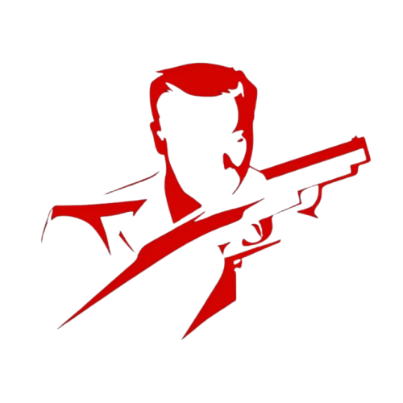
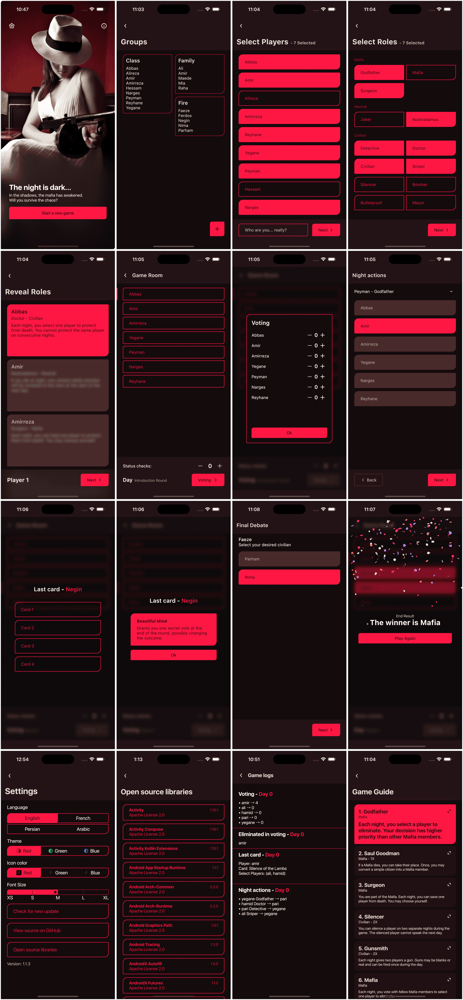

  

# Mafiauto 🕵️‍♂️

**Mafiauto** is an intelligent automation assistant for playing the Mafia game.  
It fully automates the entire Mafia gameplay — handling night actions, voting, and win conditions —
so players can focus on the game itself.

## 🚀 Features

- Full automation of Mafia game logic
- Role assignment, night phases, and voting
- Win detection and smooth transitions
- Friendly and clean UI

## 📥 Download

## 🧠 Roles Included

Mafiauto supports a variety of roles, and new ones are being added and updated regularly.

| Role         | Alignment | Description                                                                                                                                           |
|--------------|-----------|-------------------------------------------------------------------------------------------------------------------------------------------------------|
| Godfather    | Mafia     | Each night, you select a player to eliminate. Your decision has higher priority than other Mafia members.                                             |
| Saul Goodman | Mafia     | If a Mafia dies, you can take their place. Once, you may convert a simple citizen into a Mafia member.                                                |
| Mafia        | Mafia     | Each night, you vote with fellow Mafia members to select one player to eliminate.                                                                     |
| Surgeon      | Mafia     | You are part of the Mafia. Each night, you can save one player from death. You may choose yourself.                                                   |
| Doctor       | Civilian  | Each night, you can protect one player from death. You cannot choose the same player two nights in a row.                                             |
| Detective    | Civilian  | Each night, you investigate one player to determine whether they are a member of the Mafia.                                                           |
| Civilian     | Civilian  | You have no night action. During the day, you must observe carefully and vote wisely.                                                                 |
| Sniper       | Civilian  | During the game nights, you can shoot two times. If the target is Mafia, they die. Otherwise, you die instead.                                        |
| Silencer     | Civilian  | You can silence a player on two separate nights during the game. The silenced player cannot speak the next day.                                       |
| Bulletproof  | Civilian  | You are immune to the first night-time attack. After that, you become vulnerable like others.                                                         |
| Mayor        | Civilian  | You have no night action, but you know the Doctor and Surgeon roles. The game master informs you about them.                                          |
| Gunsmith     | Civilian  | Each night gives two players a gun. Guns may be blanks or real and can be fired once during the day.                                                  |
| Ranger       | Civilian  | If targeted by Mafia, can shoot. Stays alive if hitting Mafia, dies if hitting Civilian.                                                              |
| Bomber       | Civilian  | If you die, two players next to you also die.                                                                                                         |
| Nostradamus  | Neutral   | At the introduction night, you choose three players, and the game master tells you how many of them are Mafia. The Godfather is not counted as Mafia. |
| Joker        | Neutral   | You have no night action. Your goal is to get voted out during the day in order to win the game.                                                      |

## 🧩 Built With

- Jetpack Compose
- Clean Architecture with MVVM

## 🤝 How to Contribute

We welcome contributions to improve Mafiauto!  
To contribute:

1. Fork the repository
2. Create a new branch (`git checkout -b feature/my-feature`)
3. Commit your changes (`git commit -am 'Add new feature'`)
4. Push to your branch (`git push origin feature/my-feature`)
5. Open a pull request

## 📄 License

This project is licensed under the MIT License.

---

Enjoy the game — let **Mafiauto** handle the rules.